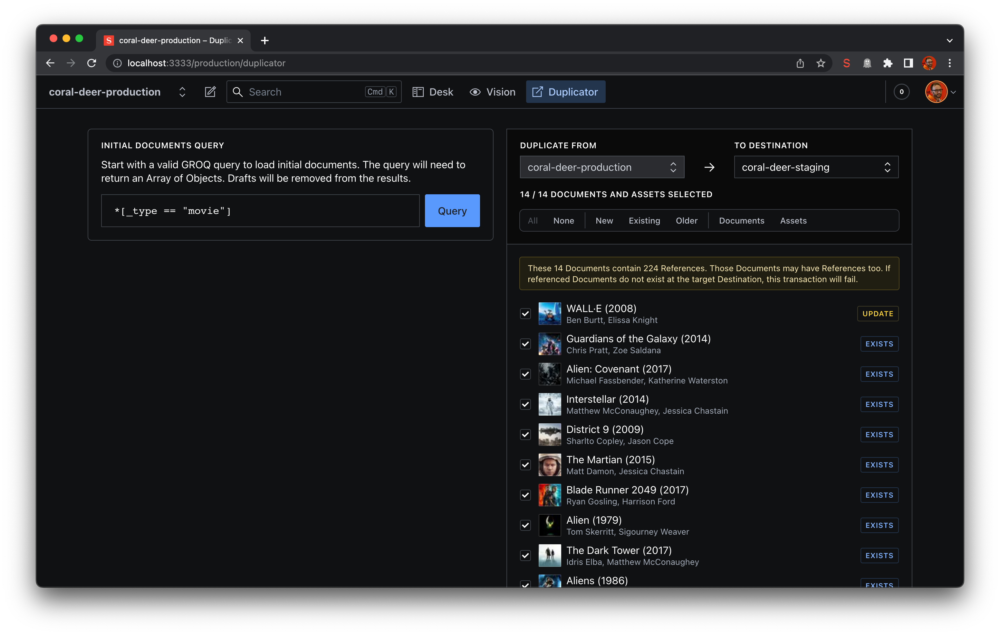
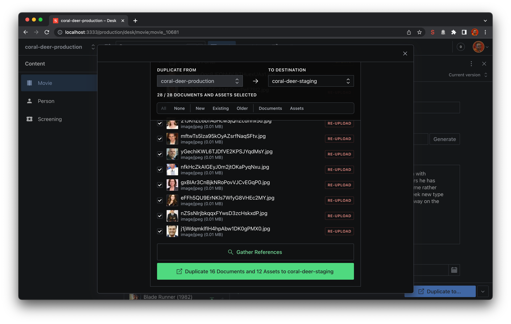

# Cross Dataset Duplicator

Sanity Studio v3 Tool and Document Action for empowering content editors to migrate Documents and Assets between Sanity Datasets and Projects from inside the Studio.

## Installation

```
npm install --save @sanity/cross-dataset-duplicator
```

or

```
yarn add @sanity/cross-dataset-duplicator
```

### Important Notes

This plugin is designed as a convenience for Authors to make small, infrequent content migrations between Datasets.

- This plugin should be used in conjunction with a reliable backup strategy.
- Proceed with caution as this plugin can instantly write changes to Datasets.
- Larger migrations may take more time, especially with Assets. Trying to upload them all at once could result in a rate-limiting issue, so the plugin mitigates this by limiting simultaneous asset uploads to 3.
- If an Asset is already present at the destination, there's no need to duplicate it again.
- Before starting a Duplication you can select which Documents and Assets to include. Migrations will fail if every Referenced Document or Asset is not included in the transaction or is already present at the destination Dataset.

## Tool

The **Duplicate** Tool allows you to migrate Documents that are returned from any GROQ query.



## Document Action

The **Duplicate to...** Document Action allows you to migrate an individual Document.



## Required Setup

### 1. Workspaces

You must have more than one [Workspace configured](https://www.sanity.io/docs/config-api-reference#37c85e3072b2) to use this plugin.

All Datasets and Project IDs set up as Workspaces will become selectable "destinations" for Migrations.

Once set up, you will see a dropdown menu next to the Search bar in the Studio with the Datasets you have configured.

### 2. Configuration

The plugin has some configuration options. These can be set by adding a config file to your Studio

```ts
// ./sanity.config.ts

 import {defineConfig} from 'sanity'
 import {crossDatasetDuplicator} from '@sanity/cross-dataset-duplicator'

 export const defineConfig({
  // all other settings...
  plugins: [
    // all other plugins...
    crossDatasetDuplicator({
      // Required settings to show document action
      types: ['article', 'page'],
      // Optional settings
      tool: true,
      filter: '_type != "product"',
      follow: [],
      queries:[
        {
          label: "All articles",
          query: '_type == "article"'
        }
      ]
    })
  ]
 })
```

#### Options:

- `tool` (boolean, default: true) – Set whether the Migration **Tool** is enabled.
- `types` (Array[String], default: []) – Set which Schema Types the Migration Action should be enabled in.
- `filter` (String, default: undefined) - Set a predicate for documents when gathering dependencies.
- `follow` (("inbound" | "outbound")[], default: ["outbound"]) – Add buttons to allow the user to begin with just the existing document or first fetch all inbound references.
- `queries`(Array[{label: string, query: string}], default: []) - Add button to allow the query to be populate with predefined useful queries.

#### Action Options

The Document Action has additional config options:

- `onDuplicated` (`() => Promise<void>`, default: undefined) - fire a callback after documents have been duplicated.

The `onDuplicated` callback could be used to update update metadata after documents have been synced, or to perform arbitrary cleanup tasks like closing the dialog:

```tsx
const DuplicatorAction = ({published, onComplete}: DocumentActionProps) => {
  const [dialogOpen, setDialogOpen] = useState(false)
  const [submitting, setSubmitting] = useState(false)
  const [duplicated, setDuplicated] = useState(false)

  return {
    label: 'Duplicate',
    title: 'Duplicate',
    tone: 'positive',
    disabled: submitting || duplicated,
    loading: submitting,
    icon: PublishIcon,
    dialog: dialogOpen &&
      published && {
        type: 'popover',
        title: 'Cross Dataset Duplicator',
        content: (
          <CrossDatasetDuplicatorAction
            docs={[published]}
            onDuplicated={async () => {
              alert('data migrated')
              await new Promise((resolve) => {
                setTimeout(() => {
                  setDialogOpen(false)
                  setDuplicated(true)
                  resolve()
                }, 1000)
              })
            }}
          />
        ),
        onHandle: () => setDialogOpen(true),
        onClose: () => {
          onComplete()
          setDialogOpen(false)
          setSubmitting(false)
        },
      },
  }
}
```

### 3. Authentication Key

To Duplicate the original files of Assets, an API Token with Viewer permissions is required. You will be prompted for this the first time you attempt to use either the Tool or Document Action on any Dataset.

This plugin uses [Sanity Secrets](https://github.com/sanity-io/sanity-studio-secrets/) to store the token in the Dataset itself.

You can [create API tokens in Manage](https://sanity.io/manage)

### 4. CORS origins

If you want to duplicate data across different projects, you need to enable CORS for the different hosts. This allows different projects to connect through the project API. CORS origins configuration can be found on your project page, under the API tab.

## Future feature ideas

- Save predefined GROQ queries in the Tool to make bulk repeated Migrations simpler
- Config options for allowed migrations (eg Dev -> Staging but not Dev -> Live)
- Config options for permissions/user role checks

## License

MIT-licensed. See LICENSE.

## Develop & test

This plugin uses [@sanity/plugin-kit](https://github.com/sanity-io/plugin-kit)
with default configuration for build & watch scripts.

See [Testing a plugin in Sanity Studio](https://github.com/sanity-io/plugin-kit#testing-a-plugin-in-sanity-studio)
on how to run this plugin with hotreload in the studio.

### Release new version

Run ["CI & Release" workflow](https://github.com/sanity-io/cross-dataset-duplicator/actions/workflows/main.yml).
Make sure to select the main branch and check "Release new version".

Semantic release will only release on configured branches, so it is safe to run release on any branch.

## License

[MIT](LICENSE) © Sanity.io
